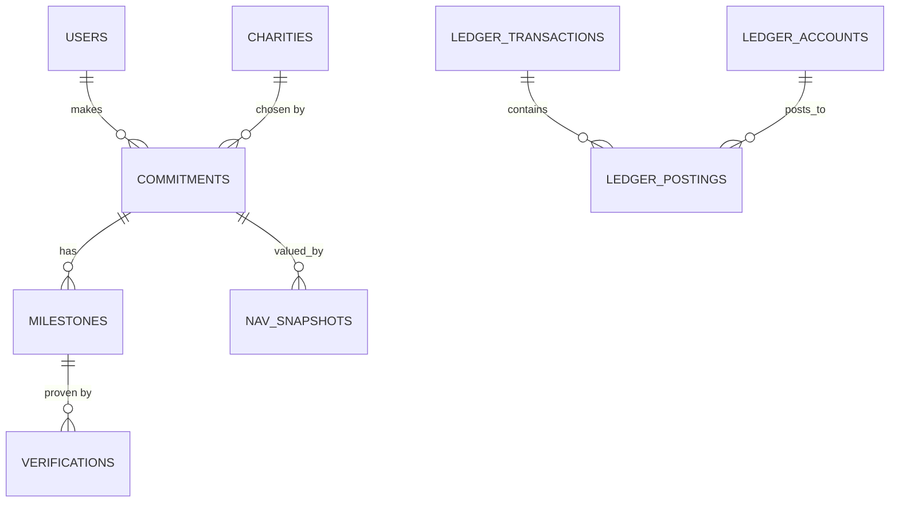

# E1-B06 — SQL Server OLTP Ledger Schema + Migration Runner

## What we built (plain English)
The SQL Server side of polyglot persistence — the "cash register." The ledger's transactional schema (users, charities, commitments, milestones, verifications, a double-entry postings ledger, community-pool stats, NAV snapshots), plus a **.NET migration runner** that applies ordered `.sql` files and records them so re-runs are no-ops. Money is `BIGINT` cents everywhere — no float touches a balance.

## The schema

Double-entry is a **transaction header + posting lines**: `ledger_transactions` (where the `idempotency_key UNIQUE` lives) and `ledger_postings` (the balanced lines against the six `ledger_accounts`: `USER_ESCROW, ACTION_POOL, USER_YIELD, WINNERS_BONUS_POOL, CHARITY_PAYABLE, HOUSE_CARRY`).

## Product limits as DB constraints (each proven by a failing test)
| Rule (from idea.md) | Enforced by |
|---|---|
| Stake $20–$500 | `CHECK (stake_cents BETWEEN 2000 AND 50000)` |
| Deadline 1 week–6 months | `CHECK (deadline BETWEEN DATEADD(DAY,7,created_at) AND DATEADD(MONTH,6,created_at))` |
| **Max 5 milestones** | `CHECK (ordinal BETWEEN 1 AND 5)` + `UNIQUE (commitment_id, ordinal)` — ordinals 1–5, unique, so at most 5 |
| One idempotent money op | `idempotency_key UNIQUE` on `ledger_transactions` |
| Ledger is append-only | `INSTEAD OF UPDATE, DELETE` triggers that `RAISERROR` on both money tables |
| Enum values (state, role, drive_mode, result) | `CHECK (... IN (...))` |

## The migration runner (the centerpiece infra)
`Boys.Ledger.Migrations.Migrator`:
- `EnsureDatabase()` creates the `boys` database if missing.
- `Apply()` ensures a `schema_migrations` table, then runs every `*.sql` in `services/ledger/migrations/` (filename order) that isn't already recorded — each file inside one transaction (rollback-on-failure), splitting on `GO` batches (so `CREATE TRIGGER` gets its own batch), recording the file on success.
- **Idempotent**: a second `Apply()` returns `0` (proven by test).

Credentials come from env or the repo `.env` (parsed without shell eval — the R1 fix).

## Key decisions
- **Migrations live in `services/ledger/migrations/`, not `docker/mssql/init/`.** The `mssql/server` image has no auto-init-dir mechanism (unlike Oracle/Postgres), and R1 removed the dead `docker/mssql/init` placeholder — so the runner is the *only* path, applied explicitly.
- **Two things stay app-enforced** (the plan flagged this as acceptable): the **zero-sum** rule (every transaction's postings sum to 0) and the **min-1 milestone** rule land in the `LedgerService` in **E3-B12/B13**, where a commitment and its milestones are created together. Max-5 is DB-enforced; min-1 needs the app.
- INT identity keys for now; `commitment_id` is stringified when it crosses gRPC.

## How to run / verify it
```bash
# apply migrations (reads root .env for the SA password)
dotnet run --project services/ledger/src/Boys.Ledger.Migrations   # -> migrations applied: 2  (0 on re-run)
dotnet test services/ledger/Boys.Ledger.sln                        # 12 tests
```
The 10 integration tests **skip cleanly when SQL Server is down** (`Xunit.SkippableFact` + a fixture that probes connectivity), so a clean clone / CI without a database still passes. Verified: with SQL up → 12 passed; with SQL unreachable → 2 passed, **10 skipped, 0 failed**.

## Gotchas / follow-ups
- `CREATE TRIGGER` must be the first statement in its batch → the migration file uses `GO` separators and the runner splits on them.
- The deadline CHECK compares `deadline` to the defaulted `created_at`; tests compute the deadline in SQL (`DATEADD(... SYSUTCDATETIME())`) to avoid C#/SQL clock skew.
- Next (E3): `Boys.Ledger.Api` + Dapper repositories + the `LedgerService` that writes balanced, zero-sum posting groups through this schema.
